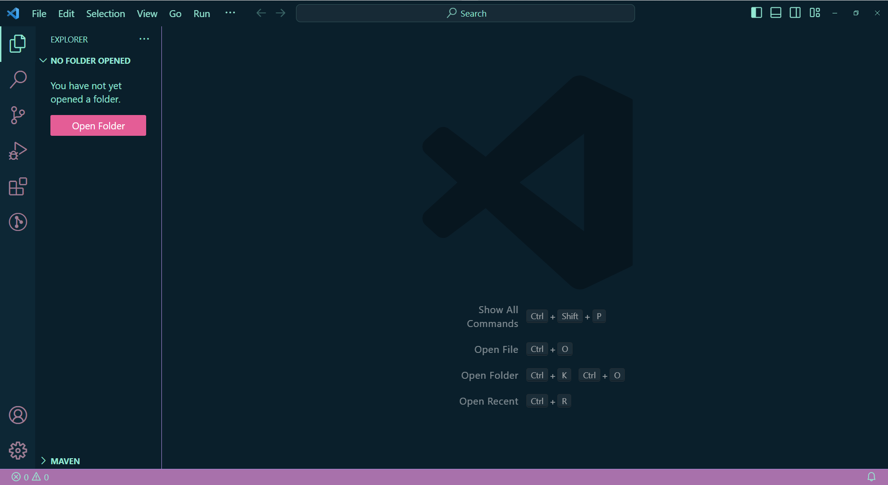

<h1 align="center" style="margin-top: 0px;">Dark Magician Girl Color Theme</h1>

    

    
     
     
     

---

## Preview

    
     
     
    
     
     
    

## Information

This is a color theme inspired by the Dark Magic Girl theme on [monkeytype.com](https://monkeytype.com).
The original creator (_AbstractUmbra_) deleted it, so this is a reupload with some color changes.

## Links

- [Github](https://github.com/Nazenano/dark-magician-girl-color-theme)
- [Marketplace](https://marketplace.visualstudio.com/items?itemName=Nazenano.dark-magician-girl-color-theme)

**Enjoy!**
